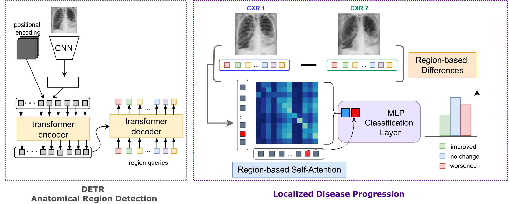
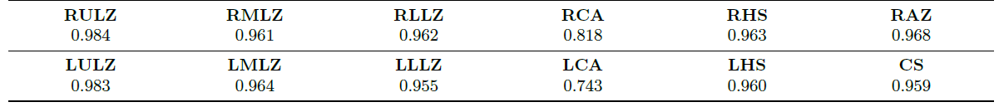
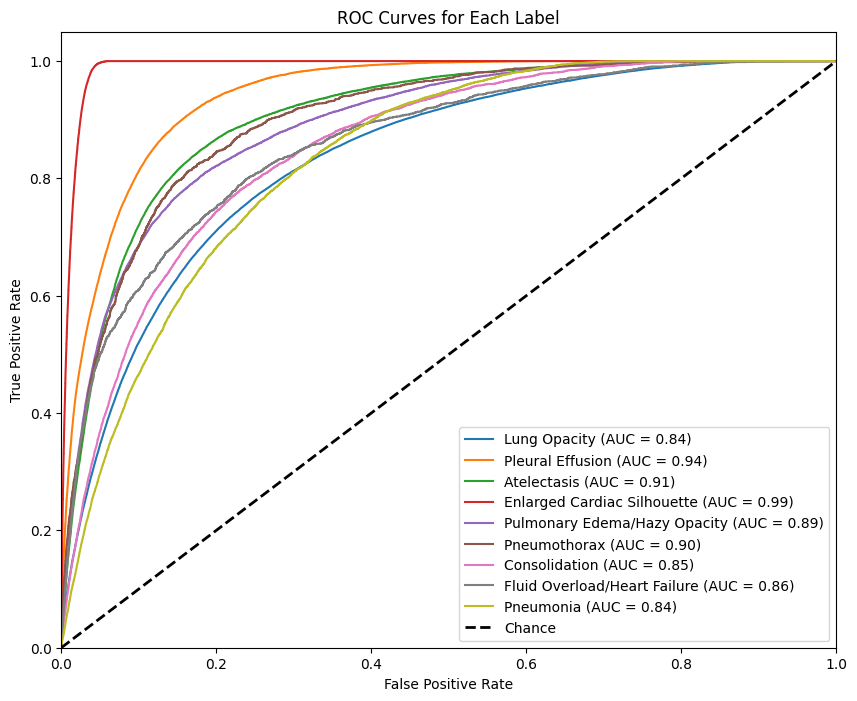
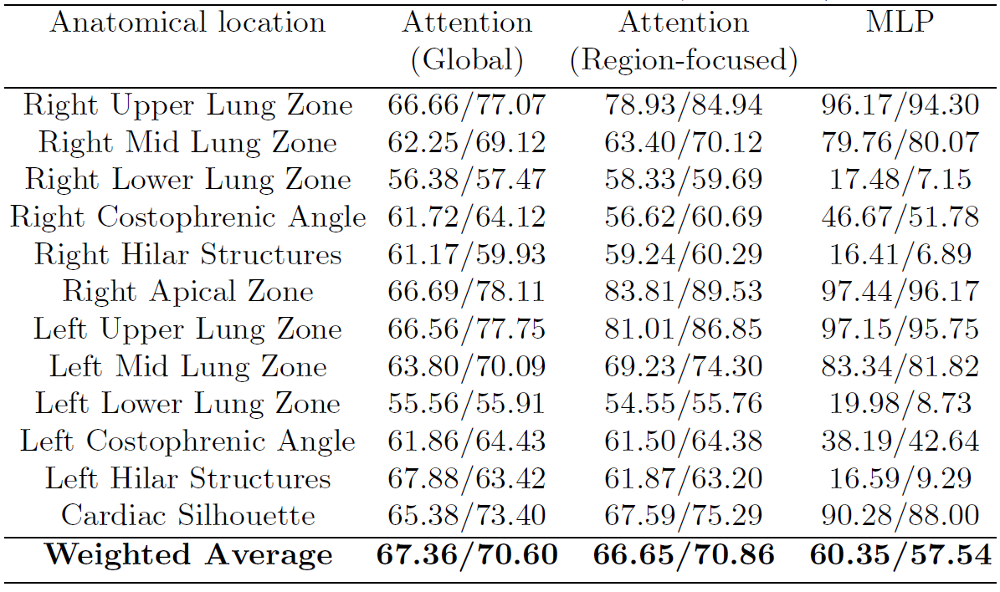
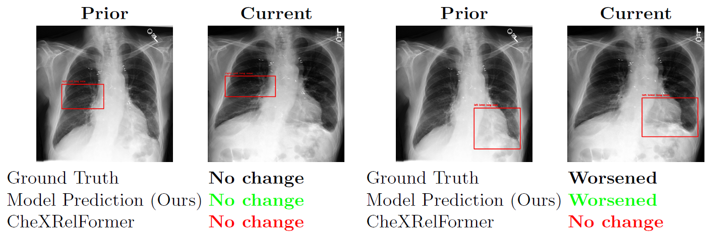

# Representation Learning with a Transformer Based Detection Model for Localized Chest X-Ray Disease and Progression Detection (accepted to MICCAI 2024)

## Abstract

Medical image interpretation often encompasses diverse tasks, yet prevailing AI approaches predominantly favor end-to-end image-to-text models for automatic chest X-ray reading and analysis, often overlooking critical components of radiology reports. At the same time, employing separate models for related but distinct tasks leads to computational overhead and the inability to harness the benefits of shared data abstractions. In this work, we introduce a framework for chest X-Ray interpretation, utilizing a Transformer-based object detection model trained on abundant data for learning localized representations. Our model achieves a mean average precision of  ∼  94% in identifying semantically meaningful anatomical regions, facilitating downstream tasks, namely localized disease detection and localized progression monitoring. Our approach yields competitive results in localized disease detection, with an average ROC 89.1% over 9 diseases. In addition, to the best of our knowledge, our work is the first to tackle localized disease progression monitoring, with the proposed model being able to track changes in specific regions of interest (RoIs) with an average accuracy  ∼  67% and average F1 score of  ∼  71%.

## Method

 *Fig. 1: We first train a DETR anatomical region detection model on a large collection of CXR images. Given a pair of CXR images, the pretrained DETR decoder extracts anatomical regions of interest (RoI) visual features for each image. These features are then used to compute the region-based visual differences between the two CXRs. The information encoded in the difference vector is summarized through self-attention weights that capture the importance of each RoI vector in relation to other RoIs and help the model to focus on relevant RoI changes. The resulting summary vector is concatenated with the region of interest (RoI) vector and fed into a multi-layer perceptron (MLP) classification layer for predicting whether the condition localized on the specific RoI has improved, worsened, or remained unchanged.*

## Quantitative Results

 *Table 2: Area under PR curves for the 12 anatomical locations with an mPA of 93.5\%. Format for each cell: (Anatomical location: Area under PR curve, IoU threshold = 0.5)*

 *Fig. 2: Localized Multi-label Disease Detection Results*

 *Table 4: Localized Disease Progression Results (Accuracy/Weighted F1)*

## Qualitative Results

<p align="center">
  
</p>
<p align="left">Fig. 3: Examples of model predictions obtained by our model compared against the ground-truth labels and CheXRelFormer model. Lung Opacity pathology (left) and Pneumonia pathology (right).</p>

## Setup

1. Install required packages using "**pip install -r requirements.txt**"
2. Replace the path in "**sys.path.append('/home/shared/kailin/github/')**" with the path to the root directory of the project.
3. In [paths.py](src/paths.py), specify the paths to the various datasets (Chest ImaGenome, MIMIC-CXR-JPG), and folders in which the runs are saved. Follow the instructions of the doc string of paths.py.

## Create train, validation and test splits

After the setup, run "**python [create_dataset.py](src/dataset/create_dataset.py)**" to create the corresponding datasets for each task (representation learning, disease classification and disease progression monitoring). See doc string of create_dataset.py for more details.

As a side note - we cannot provide you these files directly (i.e. you have to create these csv files yourself), since they contain patient information from Chest ImaGenome/MIMIC-CXR, to which only credentialed users with training in handling human participant data should have access (for privacy reasons).

## Training and Testing

For training, first specify the run configurations in the corresponding model files (representation_learning.py, localized_disease_detection.py and localized_disease_progression.py). Run "**python [train.py](src/train.py)**" to train the models. Read the doc string of train.py for further instructions.

For evaluating the model, run "**python [evaluation.py](src/evaluation.py)**". Read the doc string for more information.

## Inference

For inference, set the path to image(s) that you like to perform the inference on in inference.py and then run "**python [inference.py](src/inference.py)**"

## Citation

```
@inproceedings{dehaghani2024representation,
    title={Representation Learning with a Transformer Based Detection Model for Localized Chest X-Ray Disease and Progression Detection},
    author={Mehrdad Eshraghi Dehaghani,Amirhossein Sabour, Amarachi Madu, Ismini Lourentzou and Mehdi Moradi},
    booktitle={MICCAI},
    year={2024}
}
```

---

If you have any questions, please don't hesitate to open a new issue or contact me via linkedIn: https://www.linkedin.com/in/mehrdad-eshraghi/